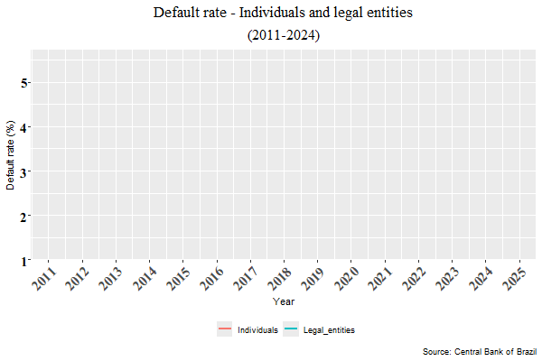
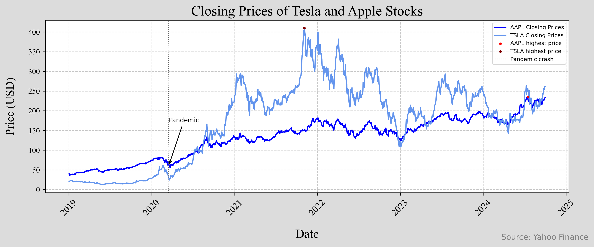
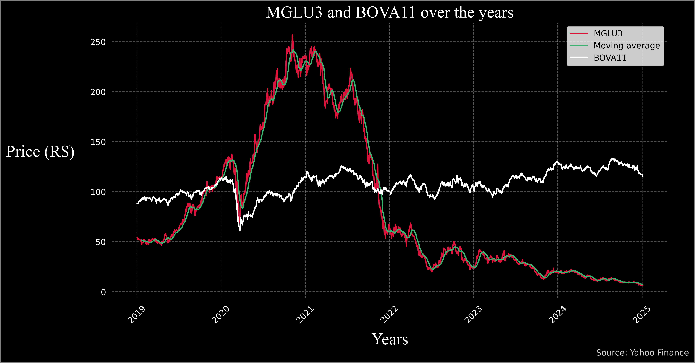

# Portfólio - Daniel Nunes Vital
### nunesvitald@gmail.com
Listo abaixo alguns dos projetos que realizei utilizando Python, R e LaTeX. *Outros trabalhos podem ser encontrados [aqui]()*

# Explorando a PNADc (terceiro trimestre  de 2024) 
Utilizando o pacote PNADcIBGE, coletei dados da Pesquisa Nacional por Amostra de Domicílio Contínua (PNADc), que agrega caractrísticas da população brasileira como renda, nível de educação e emprego.
Ao aplicar funções dos pacotes "survey" e "convey" nos microdados obtidos, é possível calcular inúmeros indicadores e taxas para a economia brasileira. Entre as diversas informações que calculei, estão:
* A taxa de desemprego nacional: 6,4%
* Taxa de desemprego na Região Metropolitana do Recife: 11,81%
* A renda média da população brasileira: R$ 3.267,7; a renda média da mulher brasileira: R$ 2.817,6; a do homem: R$ 3.605,2; e a renda média da mulher preta no estado de Pernambuco: R$ 2.151,2.
* O percentual de mulheres brancas de 20 a 30 anos que estão desempregadas: 8,479%
* A composição racial da população brasileira (valores aproximados): 42% são brancos; 10% pretos, 0,6% amarelos; 46% pardos; 0,4% indígenas e 0,01% ignorados (A definição de cada raça está de acordo com o IBGE).  

A pesquisa é de grande valia para diversas aplicações. Os dados calculados permitem uma minusciosa análise do estado econômico do país. 

[Clique aqui para acessar o código](https://github.com/Danieldnv/portfolio_p/blob/main/codigos/pnad_portfolio_en.R)  

# Inadimplência de pessoas físicas e jurídicas 
Com o pacote que acessa dados por meio da API do banco central do Brasil, eu coletei a taxa de inadimplência mensal de pessoas físicas e jurídicas (por favor, verifique a definição), de 2011 a 2024. Com essas informações, gerei um gráfico animado para mostrar de maneira dinâmica as mudanças que ocorreram nas taxas ao longo do tempo.
  

   

  

A definição, de acordo com o site oficial do Banco Central é: *Percentual da carteira de crédito do Sistema Financeiro Nacional com pelo menos uma parcela com atraso superior a 90 dias. Inclui operações contratadas no segmento de crédito livre e no segmento de crédito direcionado.* [Verifique aqui](https://dadosabertos.bcb.gov.br/dataset/21083-inadimplencia-da-carteira-de-credito---pessoas-juridicas---total)  

[Clique aqui para acessar o código](https://github.com/Danieldnv/portfolio_p/blob/main/codigos/animated_plot_portfolio.R)  

# Preços de fechamento das ações da Tesla e da Apple
Utilizando a biblioteca "yfinance", coletei informações sobre as ações da Tesla e da Apple por meio da API do Yahoo! Finance. A partir dos dados obtidos, separei os preços de fechamento e gerei uma representação visual que ilustra, para ambas as ações, o principal impacto da pandemia de COVID-19 nos preços, bem como a maior cotação durante 01/01/2019 e 01/10/2019.  
É possível observar que, apesar da grande queda durante a COVID-19, o valor de ambas as ações apresentaram forte crescimento, superando as cotações anteriores por uma grande marge.

   

  

[Clique aqui para acessar o código](https://github.com/Danieldnv/portfolio_p/blob/main/codigos/tesla_apple.ipynb)  

# MGLU3, BOVA11, Dólar e Ibovespa

Nesse projeto, também fazendo uso da biblioteca "yfinance", construí uma visualização do ETF BOVA11 e da ação da MGLU3 acompanhada de sua média móvel para o período.
Adicionalmente, coletei informação sobre o índice ibovespa e do dólar, destacando a data em que o copom definiu a SELIC em 11,25%. 

   

  

   

  

[Clique aqui para acessar o código](https://github.com/Danieldnv/portfolio_p/blob/main/codigos/stock_dolar_ibov2.ipynb)  

# LaTeX  
Apesar de não serem diretamente ligadas a ciência de dados, as habilidades que desenvolvi criando esses projetos me permitem contribuir significativamente com documentos em LaTeX, que podem ser de grande valia para relatórios de uso interno ou destinados aos clientes. Essa linguagem de programação é excelente para escrever tabelas, equações, símbolos matemáticos, gráficos e textos, agregando todos os elementos de forma visualmente agradável e organizada.  
Entre os pacotes que utilizei nesses documentos, estão: amsmath, amssymb, graphicx, pgfplots, e tikz. 

Esses documentos foram criados para uso pessoal, como forma de resumo durante a preparação para as provas

## Cálculo - LaTeX  

   

  

[Clique aqui para acessar o código](https://github.com/Danieldnv/portfolio_p/blob/main/codigos/calculustex.tex)  

## Estatística - LaTeX  

   

 

[Clique aqui para acessar o código](https://github.com/Danieldnv/portfolio_p/blob/main/codigos/statisticstex.tex)  

